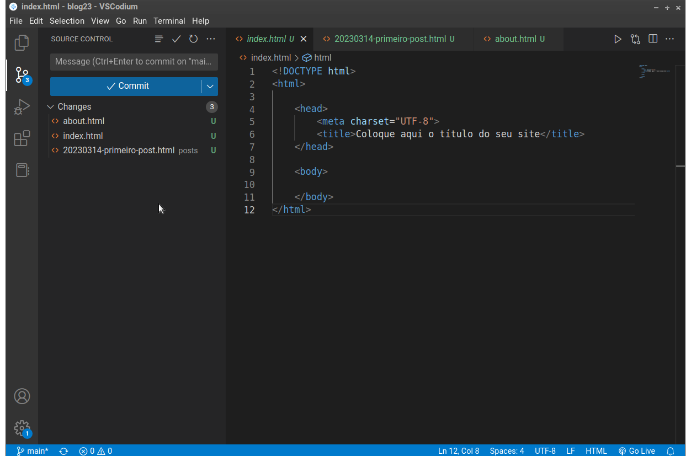
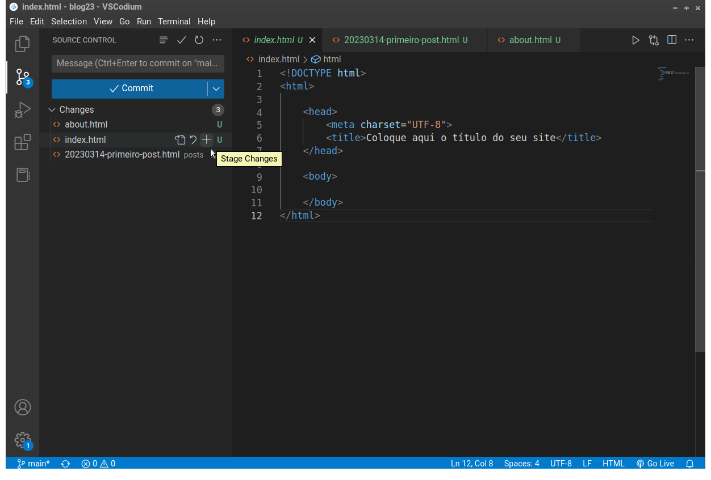
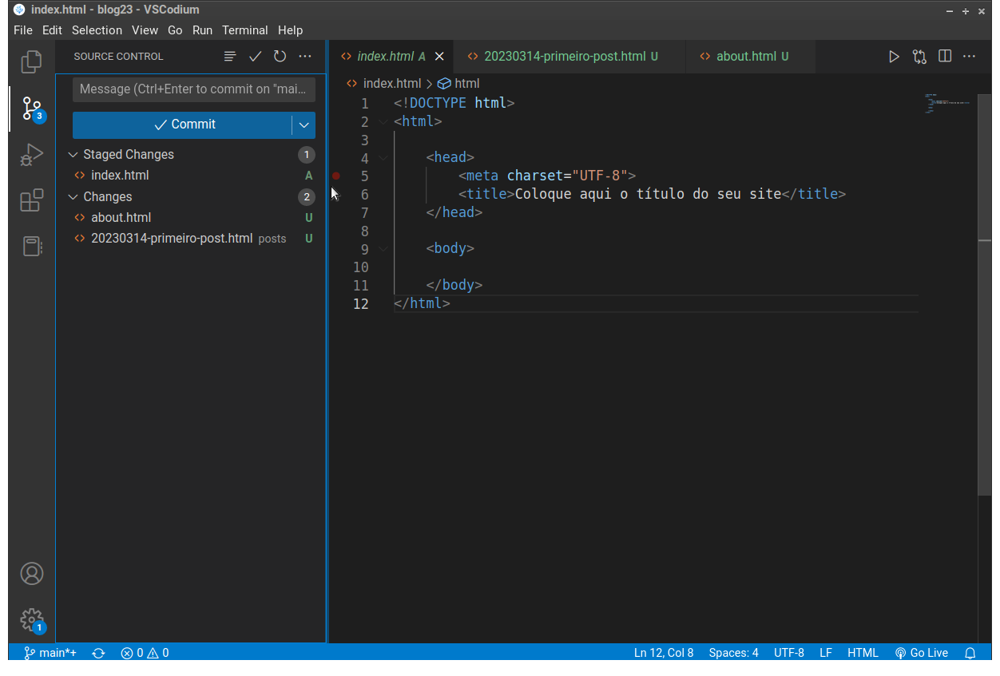
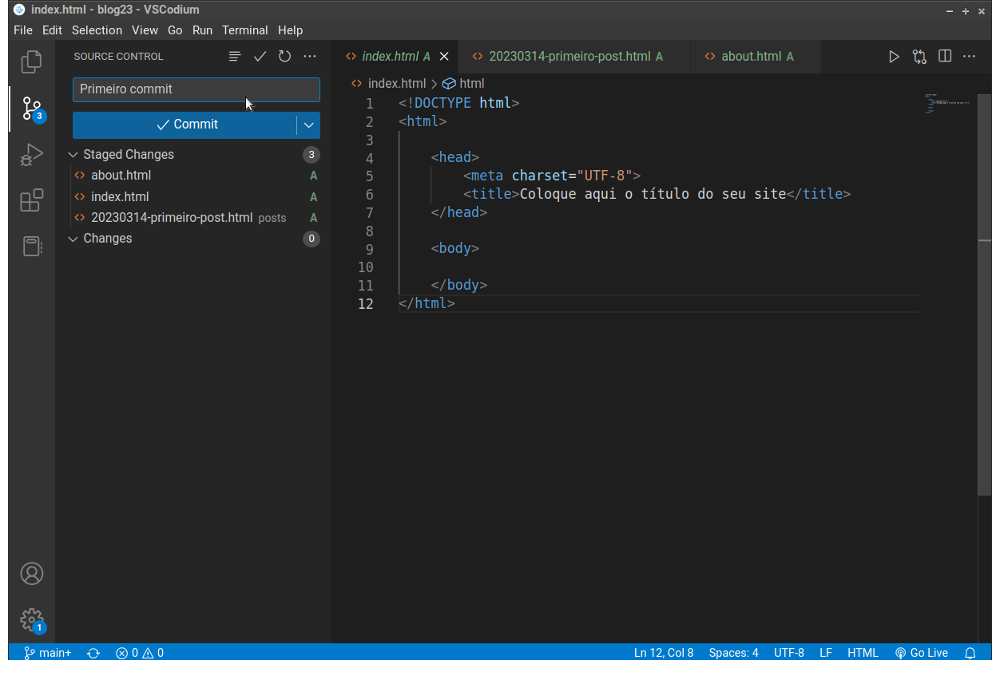
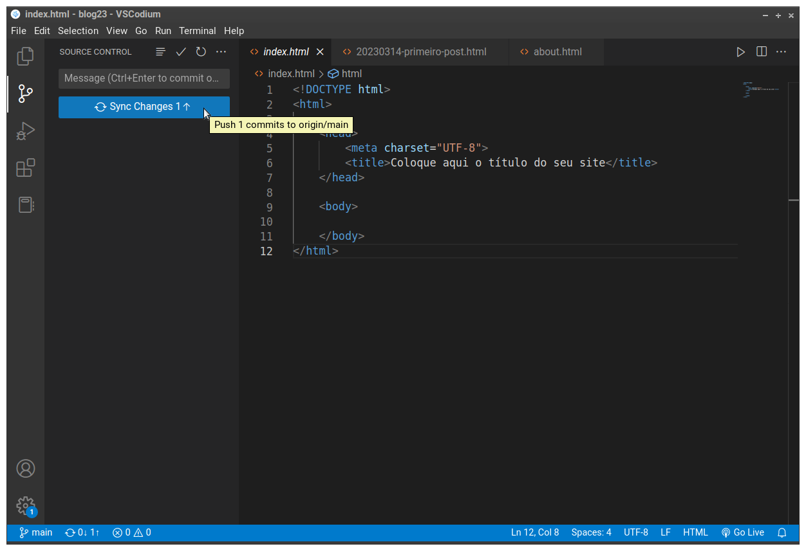
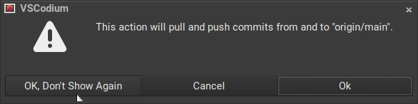
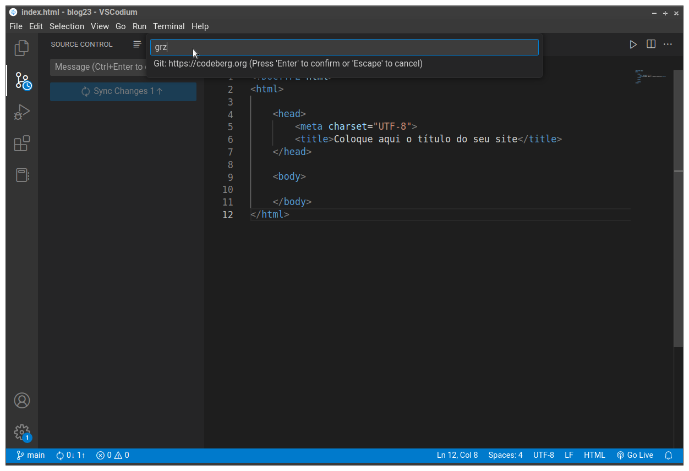
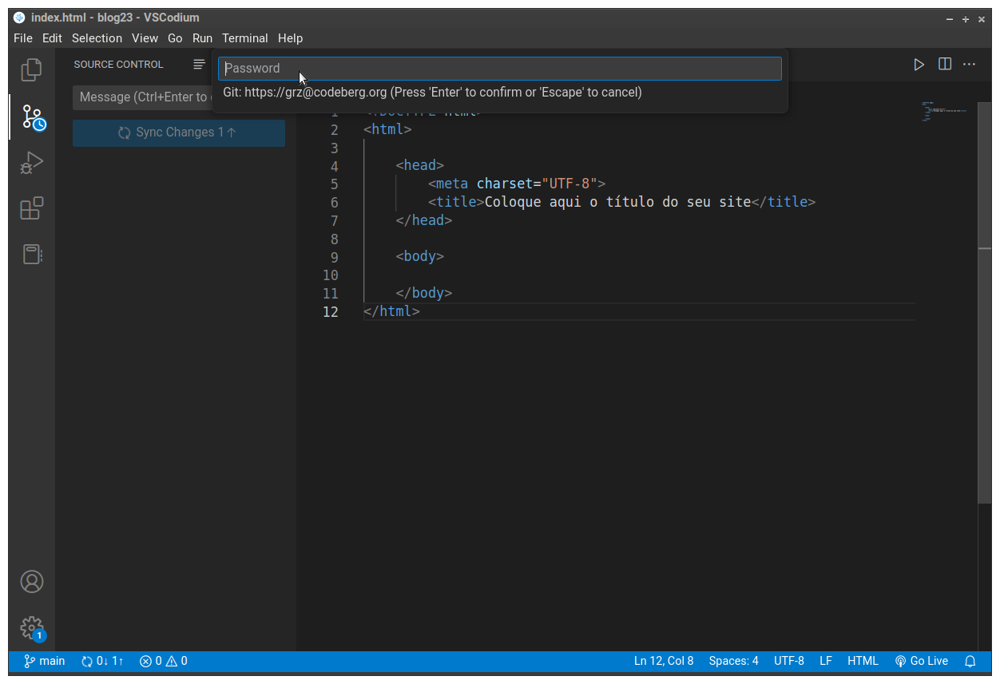

[Índice](README.md)

# Atualizar o repositório no Codeberg

Para atualizarmos nosso repositório de código remoto, que está armazenado no Codeberg, vamos usar dois novos comando do GIT: <code>commit</code> e <code>push</code>. 

## Commit e Push

O processo de envio de atualizações para o repositório remoto é chamado <code>push</code> (que literalmente significa 'empurrar' mas, neste contexto, o sentido é de 'enviar'). 

Esse *push* só pode acontecer após uma etapa preliminar chamada <code>commit</code> (que literalmente significa 'comprometer-se').

O processo de *commit* diz ao GIT que as mudanças que fizemos em um arquivo devem ser levadas ao repositório na próxima vez que um *push* for executado. Isto é, estamos dizendo que estamos nos 'comprometendo' com estas mudanças ao ponto de que elas já podem ser publicadas no repositório principal.

## Passos para commit (VSCodium)

1. <kbd>Ctrl+Shift+G</kbd> Para mudar para a aba com as operações do GIT. Note que o painel da esquerda mudou.

<figure>

<figcaption style = "text-align: center">Painel com operações do GIT </figcaption>
</figure>

Aqui você está vendo uma lista com todos os arquivos que podem ser adicionados à lista de arquivos de uma operação de commit.

O VSCodium usa uma letra para indicar em que estado está o arquivo que pode ser adicionado. 

Um arquivo pode entrar em um commit quando:

- <code>U</code> - o arquivo for novo e o GIT ainda não está rastreando ele (U de 'Untracked' que significa 'não rastreado')

- <code>M</code> - o arquivo teve seu conteúdo modificado (M de 'Modified')

- <code>D</code> - o arquivo foi deletado (D de 'Deleted')

No caso, todos os arquivos são novos e o GIT ainda não está observando as mudanças que ocorrem neles. Para o GIT começar a cuidar essas mudanças precisamos fazer adicionar esses esses arquivos à lista de arquivos do GIT e fazer um primeiro commit.

Para isso, vá com o mouse até o nome do arquivo <code>index.html</code> e clique no sinal de <code>+</code> que vai aparecer.

<figure>

<figcaption style = "text-align: center">Botão para adicionar um arquivo na lista de commit</figcaption>
</figure>

Observe que o arquivo <code>index.html</code> agora está com o sinal <code>A</code> que significa 'Added' (adicionado). Isso é porque ele foi adicionado à lista de arquivos para o próximo commit. Antes de fazer esse commit, termine de adicionar os outros dois arquivos.

<figure>

<figcaption style = "text-align: center">Botão para adicionar um arquivo na lista de commit</figcaption>
</figure>

Agora você precisa escrever uma <code>mensagem de commit</code>. É um passo **obrigatório** e serve para documentar o seu projeto.

Esta deve ser uma mensagem curta dizendo o que mudou nesse arquivo. Uma linha e nada mais. Ela é escrita na caixa de texto acima do botão azul chamado "Commit".

Como esta é a primeira vez que estamos fazendo commit destes arquivos, nada mudou e não temos nada para escrever na mensagem. Nesses casos, costumamos escrever simplesmente "Primeiro commit". Observe a figura:

<figure>

<figcaption style = "text-align: center">Mensagem de commit</figcaption>
</figure>

Clique no botão azul "Commit" e pronto. Commit feito. Agora passamos para o "Push", para enviar os arquivos ao Codeberg.

## Passos para o push

Depois de feito o commit, você vai ver que o botão azul mudou para "Sync changes", que significa "Sincronizar mudanças".

Note que que há uma seta apontando para cima. Isso significa que existem mudanças para "subir" para o servidor. Essa é a operação de "push" que queremos fazer.

<figure>

<figcaption style = "text-align: center">GIT pronto para operação de 'push'</figcaption>
</figure>

Clique no botão azul para iniciar o push.

O VSCodium vai mostrar uma caixa de confirmação alertando que esta operação vai enviar modificações para o servidor (operação de 'push') e também baixar modificações que forem encontradas nos arquivos que estão lá (operação chamada de 'pull').

Você pode escolher a opção <kbd>Ok, don't show again</kbd>, que quer dizer "Ok, e não mostre de novo".

<figure>

<figcaption style = "text-align: center">Caixa de confirmação da operação de sync</figcaption>
</figure>

Agora você precisa digitar seu nome de usuário e senha da sua conta no Codeberg. Isso é necessário para garantir a segurança e integridade dos dados do seu repositório. Senão, todo mundo que fizesse um clone do seu repositório poderia alterar o conteúdo dele sempre que quisesse. 

No Linux e no Windows o modo de o VSCodium pedir o nome de usuário e a senha é diferente. Abaixo você tem um exemplo da interface do Linux

<figure>

<figcaption style = "text-align: center">Digitação do nome de usuário do repositório remoto (usuário da sua conta no Codeberg)</figcaption>
</figure>

<figure>

<figcaption style = "text-align: center">Digitação da senha do repositório remoto (senha da sua conta no Codeberg)</figcaption>
</figure>

No Windows vai ser aberta uma janela de um gerenciador de senhas, fora do VSCodium.

Pronto. Agora seu repositório remoto está atualizado. Para conferir, acesse o URL do seu repositório no Codeberg e veja que os arquivos novos estão lá. 

Se os arquivos não estiverem lá, volte e confira os passos todos.

[Índice](README.md)