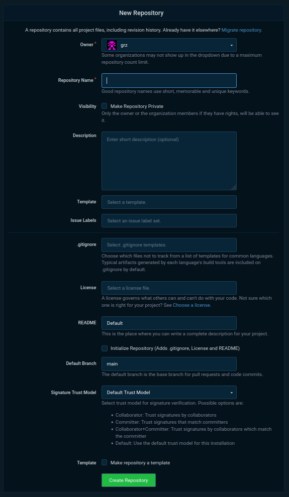

[Índice](README.md)

# Git - Criar um repositório no Codeberg

Para começar vamos criar um repositório GIT no [codeberg](https://codeberg.org) para armazenar os nossos arquivos e controlar o desenvolvimento do site. 

Você já tem uma conta no [codeberg](https://codeberg.org), que foi criada em aula.

Para criar um repositório GIT no codeberg siga os links abaixo e as instruções a seguir:

1. faça [login no codeberg](https://codeberg.org/user/login)

2. clique em [create... new repository](https://codeberg.org/repo/create)

Na página de criação de repositório que se abriu, preencha as informações solicitadas assim:

1. `Owner` - esse é o nome do dono do repositório - deve já estar preenchido com o nome do seu usuário, então, deixe assim.

2. `Repository name` - é o nome do repositório. Vou usar <kbd>iprog23</kbd> durante os exemplos, mas escolha o nome que você quiser.

> **Instruções para nome do repositório**: O repositório pode ter qualquer nome, desde que respeite as regras de nomenclatura do codeberg e as boas práticas para nomeação de repositórios de código. Basicamente, *escolha um nome curto que não contenha caracteres especias* (tipo, espaço em branco, ponto e acentos).

3. `Visibility` - É a visibilidade que o repositório terá na internet. Ele pode ser <kbd>público</kbd> (todos podem acessar e clonar) ou <kbd>privado</kbd> (apenas você terá acesso). Escolha <kbd>público</kbd>, para que eu e seus colegas possam acessá-lo. Para isso, basta não selecionar a caixa de seleção. Deixe ela como ela está.

4. `Description` - É uma descrição opcional e curta (1 linha está ótimo) do conteúdo do repositório

5. `Template` - Você pode criar este repositório copiando o modelo (em inglês, "template") de um outro repositório que você ou outra pessoa já tenha feito. Como este não é o caso, deixe em branco.

6. `Issue labels` - São rótulos usados para o rastreamento de pendências (tarefas por fazer) do repositório. Não vamos usar esse recurso neste projeto e, por isso, deixe em branco também.

7. `.gitignore` - é um arquivo de texto, chamado `.gitignore` que contém uma lista de arquivos e diretórios em seu repositório a serem ignorados pelo GIT. Isso significa que todos os arquivos e diretórios que estiverem listados nesse arquivo não serão rastreados nem controlados pelo GIT. Em consequência disso, também não serão armazenados no repositório. Deixe em branco porque não vamos precisar desse arquivo neste projeto.

8. `License` - Esta é a licença de uso que você concede a todos que acessarem seu repositório.

> **Licenças**: Sugiro que seja a [MIT](https://choosealicense.com/licenses/mit/), que basicamente dá licença para que possamos fazer o que quiser com o código, inclusive copiar, modificar, distribuir, usar pedeços dele em outros projetos e até comercialmente (o que não é nosso caso), desde que a licença (que inclui o seu nome no copyright) seja distribuída junto com os trabalhos derivados.

9. `README` - Opção pra criar um arquivo `README` automaticamente. Escolha a oção <kbd>Default</kbd>.

10. `Initialize repository (Adds .gitignore, Licence and README)` Sim. Deixe essa caixa de verificação selecionada. Isso vai fazer o codeberg copiar os arquivos `.gitignore`, `README` e o da licença para dentro do seu repositório. Assim, quando ele for criado já vai ter um conteúdo inicial.

> Atenção para esse passo 10! Se você sem querer desselecionar essa caixa de verificação vai ter mais trabalho adiante para inicializar seu repositório. Neste roteiro não constam as instruções para fazer essa inicialização manualmente. 

11. `Defaul branch` - Nome do ramo de desenvolvimento padrão. Conforme vimos em aula, o GIT pode controlar diversas linhas de desenvolvimento (versões do seu projeto) e cada uma delas terá um nome. Aqui você deve dizer qual o nome da principal. Normalmente usamos o nome `main` que significa "principal" em inglês. Então, deixe assim como está.

12. `Signature Trust Model` - Esta é uma opção útil para quem vai assinar criptograficamente os commits feitos no repositório. Não é o nosso caso agora. Por isso, deixe assim como está.

13. `Template` - Esta opção permite que você salve suas opções de criação de repositório para reutilizá-las em outros repositórios. Não precisamos disso agora. Vamos fazer tudo à mão mesmo nos próximos repositórios que criaremos. Por isso não selecione esta opção.

14. Para finalizar e criar o repositório, clique no botão verde (`Create Repository`).

[Índice](README.md)