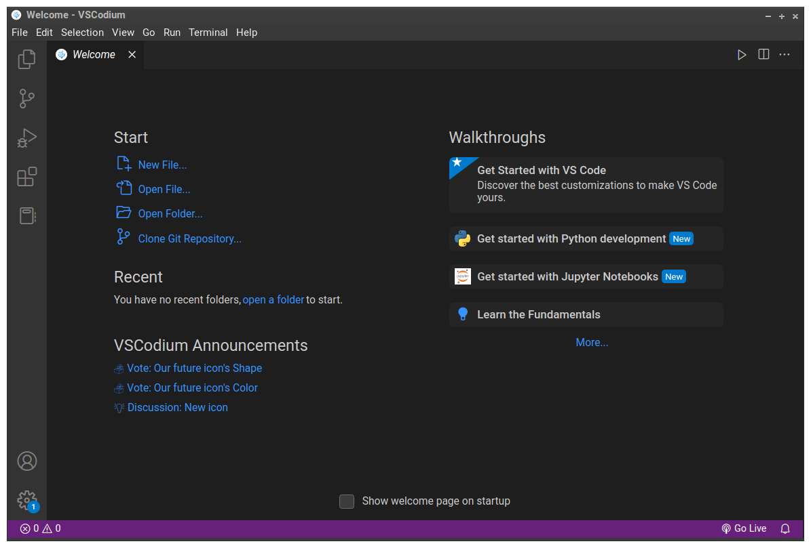

## Instalar o editor de código (VSCodium)

Precisamos de um editor de texto para escrever programas. O `nano` nos serviu bem até aqui e podemos usar ele para ainda muitos trabalhos.

Assim como o `nano`, o VSCODE é capaz de salvar arquivos em formato de texto simples.

> A diferença do VSCode para o `nano` é que ele é um ambiente integrado de desenvolvimento (IDE)

Um IDE normalmente integra ao editor de texto/código pelo menos as ferramentas de compilação/execução e depuração de código. Assim, podemos editar e rodar os programas que escrevemos sem sair do IDE e sem precisar instalar diversos programas para trabalhar.

Além disso, a digitação é mais confortável no VSCode por causa da iluminação de sintaxe e outras facilidades, como a possibilidade de instalar extensões que ampliam as funcionalidades do IDE (por exemplo, a inclusão de analisadores de código, web browsers, etc...).

## VSCode x VSCodium - Considerações sobre privacidade

O VSCode da Microsoft usa `telemetria`, que é a coleta dados sobre o uso que você faz do VSCode enquanto trabalha. O VSCode envia para esses dados para Microsoft para análise e tudo mais que a Microsoft quiser fazer com eles. Isso está descrito na licença de uso do VSCode, que você precisa aceitar quando instala o programa.

> Link para download do VisualStudio Code da Microsoft [https://code.visualstudio.com/Download](https://code.visualstudio.com/Download)

**Para preservar sua privacidade, existem opções!**

Existe uma versão do VSCode chamada `VSCodium` que é compilada **sem o código de telemetria** e outros trechos de código que usam serviços proprietários da Microsoft ou que acessam os servidores da Microsoft. 
>
> Link para o VSCodium - [https://vscodium.com/](https://vscodium.com/)
>
A licença de uso do VSCodium também é outra. Ela é a **mesma [licença MIT](https://choosealicense.com/licenses/mit/)** que usamos em nosso projeto. Ou seja, você tem as mesmas permissões de uso do código do VSCodium que as permissões que você está dando para quem quiser usar o código que está no seu repositório no Codeberg!

Após instalar o VSCodium, rode o programa e você deve ver uma tela parecida com esta:

<figure>

<figcaption style = "text-align: center">VSCodium rodando após instalação</figcaption>
</figure>
