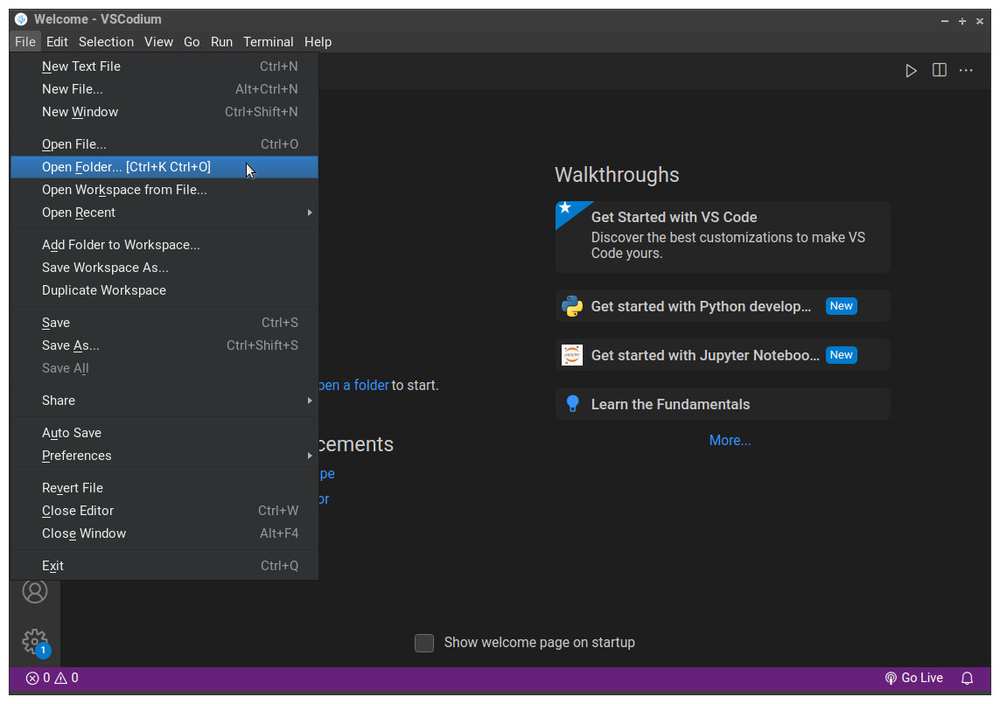
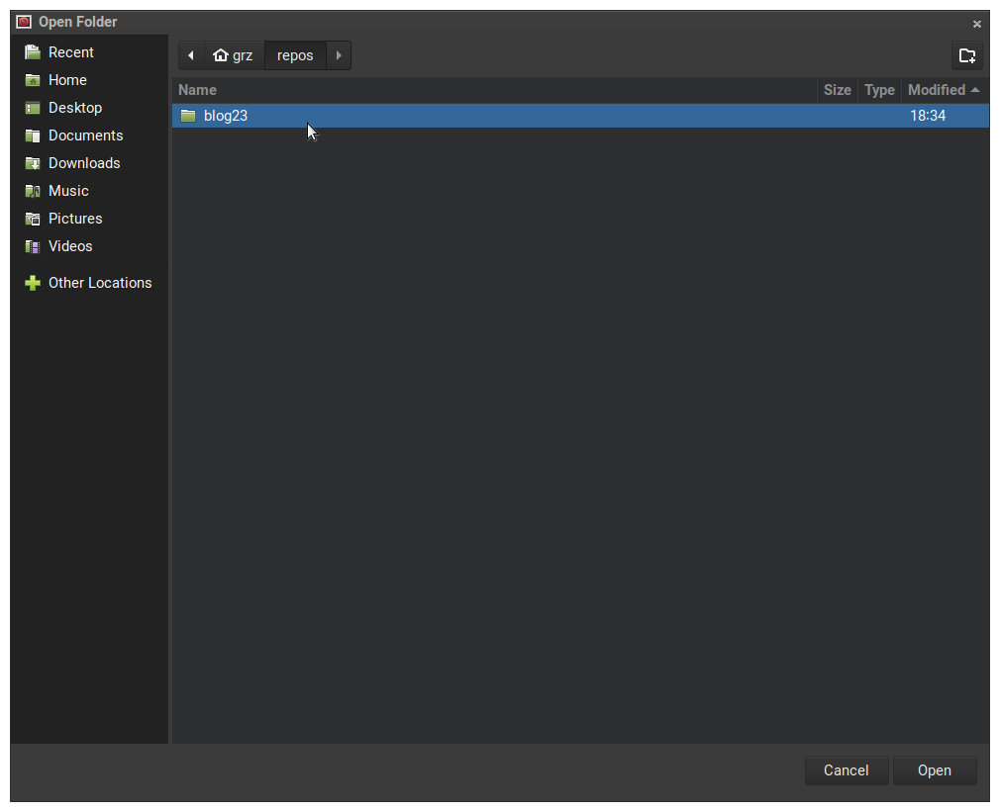
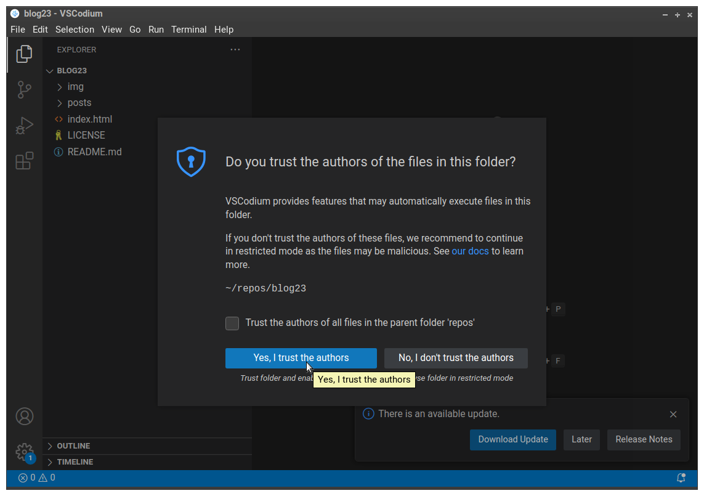

Abrir o diretório do seu projeto no VSCodium

Abra o diretório do seu projeto no VSCodium.

1. Vá no menu <kbd>File</kbd> (Arquivo)

2. Escolha a opção <kbd>Open Folder... [Ctrl+K Ctrl+O]</kbd>

<figure>

<figcaption style = "text-align: center">Comando para abrir um diretório (Folder) no VSCodium</figcaption>
</figure>

3. Na caixa de diálogo que se abrirá, vá até o diretório do seu projeto (se você não escolheu outro lugar, ele deve estar no seu diretório <code>home</code> ( aquele que tem o nome do seu usuário) e dentro do diretório <code>repos</code> que criamos, e seu nome é <code>blog23</code>). Na figura abaixo você vê um exemplo no Linux

<figure>

<figcaption style = "text-align: center">Caixa de diálogo no Linux mostrando caminho para o diretório</figcaption>
</figure>

4. Clique no botão <kbd>Open</kbd> da caixa de diálogo para abrir esse diretório no VSCodium

5. Todas as vezes que você abrir um diretório no VSCodium pela primeira vez, ele vai mostrar uma tela de confirmação perguntando se você confia ou não nos autores dos arquivos que estão nesse diretório. 

Caso você não confie no que há no diretório, o VSCodium vai desligar várias funcionalidades dele, impedindo que o código seja executado, acesse seus discos entre outras coiasas. Isso é por questão de segurança. Por exemplo, você pode ter baixado os arquivos de um repositório de um desconhecido e só quer dar uma olhada, pra ver o que tem lá. Nesse caso escolha <kbd>No, I don't trust the authors</kbd> (Não, não confio nos autores). 

> No nosso caso, escolha a opção padrão, que está em azul: <kbd>Yes, I trust the authors</kbd> (Sim, confio nos autores).

<figure>

<figcaption style = "text-align: center">Diga que você confia nos autores dos arquivos deste diretório</figcaption>
</figure>
